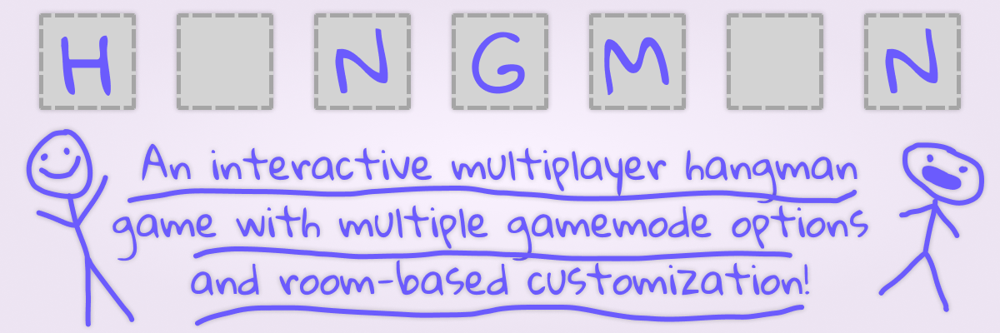
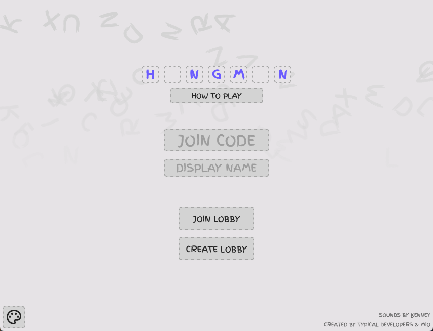
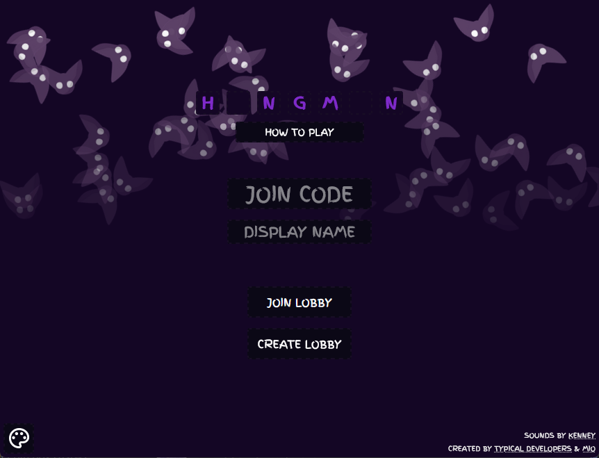

[![Contributors][contributors-shield]][contributors-url]
[![Forks][forks-shield]][forks-url]
[![Stargazers][stars-shield]][stars-url]
[![Issues][issues-shield]][issues-url]
[![MIT License][license-shield]][license-url]

> A multiplayer web-game that I worked on in 2021 and have decided to publicize now. Additions through pull requests are accepted!

---

# Try it here!
https://h-ngm-n.hoofydoofy.repl.co/

# Pull Requests / Issues
Feel free to do as you wish so long as it contributes something new or fixes existing problems. As far as I am aware, there is only 1-2 bugs within the codebase that I cannot remember.

# Licensing
h-ngm-n is licensed under CC0 1.0! 

All audio assets are also licensed under CC0 1.0 by Kenney.

[contributors-shield]: https://img.shields.io/github/contributors/HooferDevelops/h-ngm-n.svg?style=flat-square
[contributors-url]: https://github.com/HooferDevelops/h-ngm-n/graphs/contributors
[forks-shield]: https://img.shields.io/github/forks/HooferDevelops/h-ngm-n.svg?style=flat-square
[forks-url]: https://github.com/HooferDevelops/h-ngm-n/network/members
[stars-shield]: https://img.shields.io/github/stars/HooferDevelops/h-ngm-n.svg?style=flat-square
[stars-url]: https://github.com/HooferDevelops/h-ngm-n/stargazers
[issues-shield]: https://img.shields.io/github/issues/HooferDevelops/h-ngm-n.svg?style=flat-square
[issues-url]: https://github.com/HooferDevelops/h-ngm-n/issues
[license-shield]: https://img.shields.io/github/license/HooferDevelops/h-ngm-n.svg?style=flat-square
[license-url]: https://github.com/HooferDevelops/h-ngm-n/blob/master/LICENSE.txt
